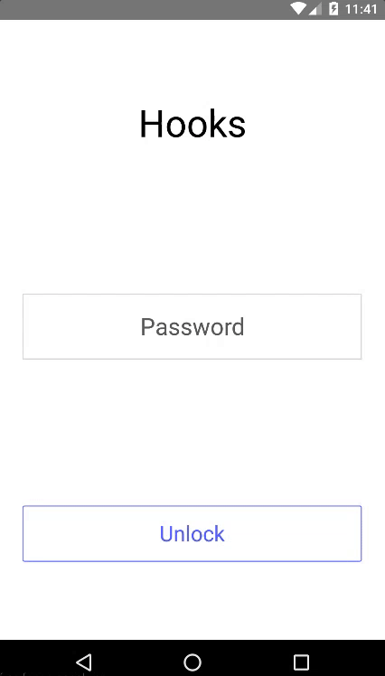

# Hooks

List, run, and see the output from scripts in your ```.hooks-app/hooks/``` directory. All over SSH, so there's nothing to install on your server.



## Example uses

- See which containers are running on the server
- Run a backup script
- Pull and publish the latest updates of a static site

## Develop

- [Install the React Native CLI and the Android SDK](https://facebook.github.io/react-native/docs/getting-started.html)
- Start your Android emulator (or plug in your Android phone with debugging enabled)
- At the root of this project:
  - ```npm install```
  - ```react-native link```
  - ```react-native run-android```
